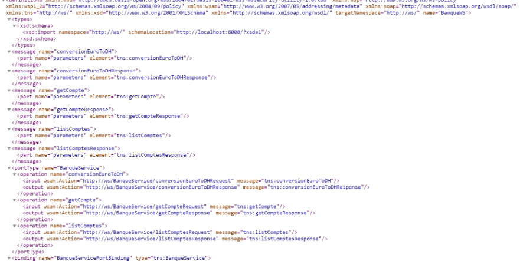

# Web Services SOAP
## Description

This project showcases the development, implementation, and validation of a SOAP-based web service leveraging Java and JAX-WS. The service offers robust features for both currency conversion and account administration.

## Project Structure
 ```bash
client-soap-ws
└───src
    ├───main
    │   ├───java
    │   │   └───ma
    │   │       └───main.java
    │   │   └───proxy
    │   └───resources
    └───test
src
├───main
│   ├───java
│   │   └───ws
│   │        ├───BanqueService.java
│   │        └───Compte.java
│   │   └───ServerJWS.java
│   └───resources
└───test
 ```

## Features

- **Currency Conversion:** Convert an amount from Euro to Moroccan Dirhams.
- **Account Management:** 
  - Retrieve details of a specific account.
  - Retrieve a list of all available accounts.

## Prerequisites

- Java Development Kit (JDK) version 8 or later
- Apache Tomcat or any server that supports JAX-WS
- An Integrated Development Environment (IDE) like IntelliJ IDEA or Eclipse
- For testing, you'll need tools like SOAP-UI or Oxygen XML Editor

## Setup and Deployment

 1. Create the Web Service

 2. Deploy the Web Service
Deploy the web service onto a server compatible with JAX-WS, such as Apache Tomcat. Verify that the web.xml configuration is accurate for deploying a SOAP service.
 3. Analyze the WSDL
Once deployed, you can access the WSDL file through a web browser using the URL `http://<server-address>:<port>/BanqueWS?wsdl` for example :` http://localhost:9090/?wsdl.`

## WSDL Analysis

Utilize a web browser or a tool like SOAP-UI to examine the WSDL. The WSDL delineates the accessible operations, data types, and the service endpoint.
## Testing the Web Service

### Using SOAP-UI

1. **Create a New SOAP Project:**
   - Input the WSDL URL.
   - SOAP-UI will automatically create the request templates.


2. **Test Operations:**
   - **ConversionEuroToDh:** Assess the currency conversion operation.
   - **GetCompte:** Retrieve a designated account.
   - **GetComptes:** Retrieve the roster of accounts.




## Conclusion

This project demonstrates the development and deployment of a SOAP-based web service using JAX-WS, alongside the creation of a Java client for interfacing with the service. The service facilitates currency conversion, allows for account consultation, and provides functionality to list all accounts.
